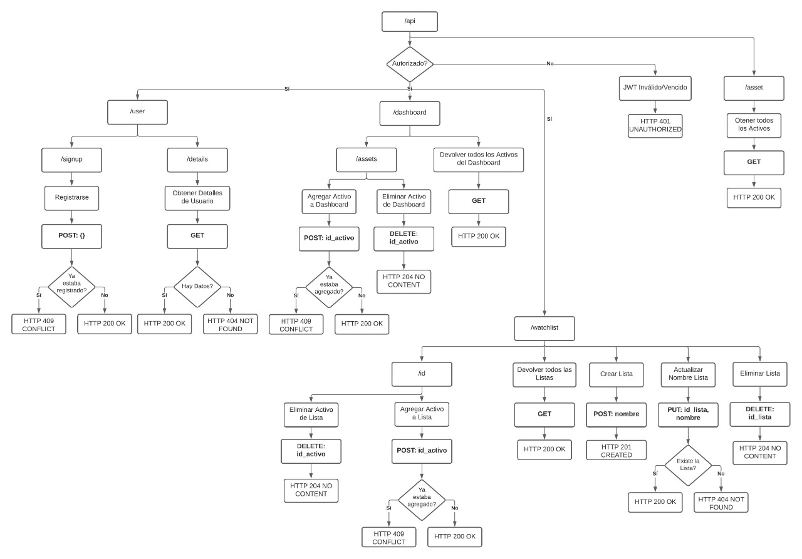

# main
information about the project

to run you must need to:

## Back End

###  user data store
    
 - **link**
	 - https://github.com/Primera-Generacion-AHK-Sistemas/SpringBootAuth0API
 - **to run**
	 - run app.class
 - **information**
	 - with the credential of auth0 save user data in the **postgresql** database 
	https://www.elephantsql.com/

###  historic data of actions
    
 - **link**
	 - https://github.com/Primera-Generacion-AHK-Sistemas/flask_yahoo_finance
 - **to run**
	 - python -m pip install -r requirements.txt
            python app.py
 - **information**
	 - access to historic prices of each company
            
	    Last price:
	    https://flask-yahoo-fin.herokuapp.com/api/live-price?ticker=MSFT
	    
	    List of prices between start_date & end_date
	    https://flask-yahoo-fin.herokuapp.com/api/price-between?ticker=MSFT&start_date=YYYY/MM/DD&end_date=YYYY/MM/DD
	    
	    List of prices between today - 365 days
	    https://flask-yahoo-fin.herokuapp.com/api/year-today-price?ticker=MSFT
	    

## Front End

### auth0 angular example
    
 - **link**
	 - https://github.com/tomasmerencio/ahk-front-angular
 - **to run**
	 - ng serve
 - **information**
	 - get credential from auth0 to connect with spring boot
     
### dashborad angular example
    
 - **link**
	 - https://github.com/Primera-Generacion-AHK-Sistemas/AngularArgonDashboard
 - **to run**
	 - ng serve
 - **information**
	 - display graphs from the data of spring boot

## Infraestructure

### Networking

 - **CloudFlare**
	 - https://www.cloudflare.com/plans/
	 - https://support.cloudflare.com/hc/en-us/articles/200168256-Understand-Cloudflare-Caching-Level
	 - https://support.cloudflare.com/hc/en-us/articles/360021806811-Getting-Started-with-Cloudflare-Caching
     
### Domains
 - **Nicar**
   - https://nic.ar/
     - dot AR domain 
       - price : 540.00 AR$
     - dot COM dot AR domain 
       - price : 270.00 AR$
     - dot NET dot AR domain 
       - price : 270.00 AR$

### Cloud Services Providers
 - **Heroku**
   - for testing with limited capabilities
   - https://www.heroku.com/ 
 - **Azure**
   - App Service
     - https://azure.microsoft.com/en-us/pricing/details/app-service/windows/
   - API Service
     - https://azure.microsoft.com/en-us/pricing/details/api-management/
   - Containers
     - https://azure.microsoft.com/en-us/pricing/details/kubernetes-service/
   - Cost Calculator
     - https://azure.microsoft.com/en-us/pricing/calculator/
   - Mongo DB
     - https://www.mongodb.com/cloud/atlas

### user data store api info

